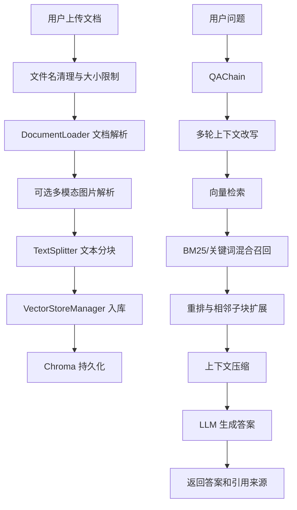

# RAG 技术详解

本文档说明本项目的 RAG 链路、关键模块、缓存策略和可维护边界。面向后续开发、排查和性能优化。

## 一、总体链路



## 二、文档上传链路

入口在 `main.py` 的 `/upload`。

主要步骤：

1. 校验 API 密钥。
2. 清理上传文件名，避免路径穿越和异常字符。
3. 校验扩展名，目前支持 `.pdf`、`.txt`、`.docx`、`.md`。
4. 分块写入临时文件，超过 `MAX_UPLOAD_SIZE` 立即中止。
5. 调用 `DocumentLoader` 解析文档。
6. 可选调用 `multimodal.py` 提取图片并生成说明文本。
7. 调用 `TextSplitter` 分块。
8. 调用 `VectorStoreManager.add_documents()` 入库。
9. 入库后失效 collection 快照缓存。

## 三、文档解析

模块：`rag/document_loader.py`

| 格式 | 解析方式 |
| --- | --- |
| PDF | `PyPDFLoader` |
| TXT | 原生文本读取 |
| Markdown | 原生文本读取，避免 HTML 污染 |
| DOCX | `Docx2txtLoader` |

解析结果会统一补充 metadata：

- `source`
- `file_path`
- `file_type`
- `file_size`
- `upload_time`
- `original_filename`
- `safe_filename`

## 四、多模态解析

模块：`rag/multimodal.py`

支持从 PDF 和 DOCX 中提取图片，然后调用 OpenAI-compatible 视觉模型生成中文说明。生成的说明以普通 `Document` 形式进入后续分块和向量化流程。

关键配置：

- `ENABLE_MULTIMODAL_PARSING`
- `MULTIMODAL_MODEL`
- `MULTIMODAL_MAX_IMAGES_PER_FILE`
- `MULTIMODAL_IMAGE_MAX_SIDE`
- `MULTIMODAL_IMAGE_MIN_BYTES`
- `MULTIMODAL_TIMEOUT`

失败策略：

- 图片提取失败只记录 warning。
- 单张图片解析失败会跳过该图片。
- 不影响文本文档入库主流程。

## 五、文本分块

模块：`rag/text_splitter.py`

策略：

- Markdown：优先按标题层级切分，再递归拆分超长内容。
- 其他格式：使用 `RecursiveCharacterTextSplitter`。
- 对包含代码块、公式、核心概念的 Markdown 块，尽量保持完整。

默认配置：

- `CHUNK_SIZE=500`
- `CHUNK_OVERLAP=200`

注意事项：

- 调整分块参数会直接影响召回质量和上下文完整性。
- 修改后应运行 RAG 评估用例，并至少人工验证一个真实上传问答流程。

## 六、向量存储与名称映射

模块：`rag/vector_store.py`

Chroma collection 名称不支持中文，因此项目使用映射机制：

```text
用户可见名称 -> Chroma 内部名称
测试 -> kb_0e431e89f2252e16
```

规则：

- 合法 ASCII 名称可直接使用。
- 中文或特殊名称转为 `kb_` + MD5 前缀。
- 映射保存到 `chroma_db/collection_name_mapping.json`。
- 服务启动时加载，创建或重命名时立即保存。

注意：

- 不要在真实 `chroma_db/collection_name_mapping.json` 上做临时测试。
- 测试映射逻辑时使用临时目录。

## 七、检索链路

入口：`VectorStoreManager.similarity_search()`

当前检索流程：

1. 向量检索获取较宽候选集。
2. 读取 collection 快照。
3. 使用 BM25 retriever 做关键词召回。
4. 使用 `EnsembleRetriever` 合并向量结果和 BM25 结果。
5. 如果混合检索失败，则使用向量结果 + 轻量关键词兜底。
6. 本地重排，融合向量分数、关键词命中和短语命中。
7. 扩展同一父块的相邻子块，恢复被二次切分的上下文。
8. 可选进行上下文压缩。

可调参数：

- `RETRIEVER_INITIAL_K_MULTIPLIER` / `RETRIEVER_INITIAL_K_MIN` 控制向量、BM25 和关键词的初始候选池大小。
- `RETRIEVER_RERANK_K_MULTIPLIER` 控制进入相邻子块扩展和上下文压缩前保留多少重排候选。
- `HYBRID_VECTOR_WEIGHT` / `HYBRID_BM25_WEIGHT` 控制 `EnsembleRetriever` 合并向量结果和 BM25 结果的比例。
- `RERANK_VECTOR_WEIGHT` / `RERANK_KEYWORD_WEIGHT` / `RERANK_PHRASE_WEIGHT` 控制最终本地重排分数。
- `/retrieve.trace` 会返回实际使用的候选数和权重，评测脚本可据此复现某次检索行为。

## 八、检索缓存

为减少大知识库上的重复开销，`VectorStoreManager` 维护 `_collection_cache`。

缓存内容：

```python
{
    "count": 121,
    "documents": [Document(...), ...],
    "raw_pairs": [("文本", {"source": "..."}), ...],
    "parent_index": {
        ("source.md", 3): [(0, "子块文本", {"source": "source.md"}), ...]
    },
    "bm25": BM25Retriever(...)
}
```

复用位置：

- BM25 构建。
- 关键词兜底检索。
- 相邻子块扩展。
- 文档列表聚合。

失效时机：

- 上传文档后。
- 删除文档后。
- 删除知识库后。
- 重命名知识库时。
- collection count 变化时自动刷新。

仍可优化：

- 为文档列表维护按 source 聚合的缓存。

## 九、重排与上下文压缩

模块：`rag/reranker.py`

优先调用 SiliconFlow rerank endpoint。若远程 reranker 不可用，则使用本地词法评分降级。

压缩逻辑：

- 对文档先做 rerank。
- 对普通文本按句子抽取相关句。
- 对代码块保留较长原文，避免破坏结构。
- 如果压缩结果为空，回退到基础检索 top 片段。
- 如果压缩丢掉高置信基础片段，可按配置补回少量基础片段，避免 reranker/压缩误删关键证据。

关键配置：

- `RERANKER_MODEL`
- `RERANKER_TIMEOUT`
- `RERANKER_MIN_SCORE`
- `CONTEXTUAL_COMPRESSION_SENTENCES_PER_DOC`
- `CONTEXTUAL_COMPRESSION_MAX_CHARS`
- `ENABLE_CONTEXTUAL_COMPRESSION_PROTECTION`
- `CONTEXTUAL_COMPRESSION_PROTECT_TOP_N`
- `CONTEXTUAL_COMPRESSION_PROTECT_MIN_SCORE`

`/retrieve.trace.compression` 会记录压缩输入数量、压缩输出数量、保护补回数量和降级原因。

## 十、问答生成

模块：`rag/qa_chain.py`

职责：

- 标准化最近对话历史。
- 构造上下文查询。
- 可选调用 LLM 做 query rewrite。
- 调用向量存储检索。
- 格式化上下文和引用来源。
- 调用 ChatOpenAI-compatible LLM 生成答案。
- 清理退化输出。
- 在模型过度拒答时提供有限的抽取式兜底。

查询改写保护：

- `ENABLE_QUERY_REWRITE=true` 时，系统会保留原上下文查询，并将改写结果追加为补充检索信号。
- `ENABLE_QUERY_REWRITE_FALLBACK=true` 时，如果改写后的检索没有任何候选或最终片段，会自动用原上下文查询重试一次。
- `/retrieve.trace.query_rewrite` 会记录 `attempted_query`、`final_query` 和 `fallback_used`，用于判断是否发生改写回退。

回答原则：

- 仅基于检索上下文回答。
- 上下文不足时回答“根据现有资料无法回答该问题”。
- 引用来源由系统单独展示，不要求模型在正文中编造引用。

## 十一、QAChain 运行时缓存

后端通过 `get_qa_chain()` 复用相同配置的 `QAChain`。

缓存 key：

- `collection_name`
- `top_k`
- `temperature`
- `enable_query_rewrite`
- `enable_contextual_compression`

缓存上限：16 个配置组合。

目的：

- 减少重复初始化 LLM client 和向量存储管理器。
- 避免频繁请求时产生不必要开销。

## 十二、API 层

主要接口：

| 方法 | 路径 | 说明 |
| --- | --- | --- |
| GET | `/health` | 健康检查 |
| POST | `/upload` | 上传文档并入库 |
| POST | `/ask` | 一步式问答 |
| POST | `/retrieve` | 只检索并返回片段 |
| POST | `/generate` | 基于片段生成答案 |
| GET | `/collections` | 列出知识库 |
| POST | `/collections/{name}` | 创建知识库 |
| POST | `/collections/{name}/rename` | 重命名知识库 |
| DELETE | `/collections/{name}` | 删除知识库 |
| GET | `/collections/{name}/documents` | 列出源文档 |
| DELETE | `/collections/{name}/documents` | 删除源文档 |

## 十三、安全与稳定性

已实现：

- CORS 来源通过 `CORS_ALLOW_ORIGINS` 配置。
- 可选 `API_TOKEN` 访问保护，支持 `Authorization: Bearer <token>` 和 `X-API-Token`。
- 上传文件名清理。
- 上传流式大小限制。
- 上传 MIME 与文件头校验。
- API 调用设置 timeout。
- 全局异常日志。
- 滚动文件日志，默认写入 `logs/app.log`。
- 后端稳定启动脚本。

待增强：

- 更完整的端到端测试。

## 十四、评估体系

目录：`eval/`

- `eval_cases.json`：测试用例。
- `rag_eval.py`：调用后端 API 运行评估。

运行方式：

```powershell
python eval\rag_eval.py --api-base http://127.0.0.1:8000
```

启用 `API_TOKEN` 时：

```powershell
python eval\rag_eval.py --api-base http://127.0.0.1:8000 --api-token your-token
```

建议在以下变更后运行：

- 分块策略变更。
- Embedding 模型变更。
- 检索参数变更。
- BM25/关键词逻辑变更。
- Reranker 或上下文压缩逻辑变更。
- Prompt 或拒答策略变更。

## 十五、维护建议

下一步优先级：

1. 跑通真实后端上的 `eval/rag_eval.py`。
2. 拆分 `streamlit_app.py`。
3. 补充完整端到端测试。
## 2026-05-13 补充：Embedding 入库前安全切分

SiliconFlow Embedding 接口对单条输入存在 token 上限。Markdown 标题分块为了保留代码、公式、核心概念，可能产生较长语义块，因此向量入库前会在 `rag/vector_store.py` 再做一次安全切分。

当前策略：
- `EMBEDDING_SAFE_MAX_CHARS = 300`，先用更保守的字符上限降低超限风险。
- `EMBEDDING_SAFE_MAX_ESTIMATED_TOKENS = 380`，使用本地轻量估算提前识别代码、公式、标点密集文本。
- `_split_text_for_embedding_limit()` 会在字符切分后继续检查估算 token，仍偏高时再切成更小片段。
- 不新增 tokenizer 依赖，避免引入额外安装和兼容性风险。

设计取舍：
- 该估算只作为入库前防护，不参与检索排序和问答生成。
- 选择偏保守切分，优先保证上传稳定性；语义连续性通过 `parent_chunk_index`、`sub_chunk_index` 和相邻子块扩展逻辑补偿。
## 2026-05-13 补充：Embedding 入库事务回滚与更保守切分

SiliconFlow Embedding 对单条输入有 512 token 限制。Markdown 中代码、公式、问答清单等内容经过 tokenizer 后可能比字符数估算更长，因此入库前的安全切分现在采用更保守策略：

- `EMBEDDING_SAFE_MAX_CHARS = 180`
- `EMBEDDING_SAFE_MAX_ESTIMATED_TOKENS = 300`
- `_split_text_for_embedding_limit()` 会递归切分并复查本地估算 token，直到子片段低于安全阈值。

为避免“前端显示上传失败，但 Chroma 已写入部分片段”的不一致状态，每次 `add_documents()` 会为本次入库片段写入 `ingest_batch_id`。如果后续批次调用 Embedding 或 Chroma 写入失败，系统会按该批次 ID 删除本次已写入片段，并失效 collection 快照缓存。

设计取舍：
- 不新增 tokenizer 依赖，避免引入安装和兼容性风险。
- 优先保证上传稳定性；语义连续性通过 `parent_chunk_index`、`sub_chunk_index` 和相邻子块扩展逻辑补偿。
- 回滚只删除当前失败入库批次，不按 `source` 删除旧文档，避免覆盖上传失败时误删历史已存在内容。

## 2026-05-13 补充：Embedding token 限制的运行时重试

SiliconFlow Embedding 服务端 tokenizer 可能比本地字符数和轻量估算更严格。为避免部分 Markdown 在代码、符号密集内容或中英混排片段上触发 `input must have less than 512 tokens`，向量入库增加运行时自愈策略：

- 入库前仍先执行 `_split_oversized_documents()` 和 `_split_text_for_embedding_limit()`，尽量提前把长片段降到安全范围。
- `store.add_documents()` 遇到 413 / 512 token 类错误时，`_add_documents_with_embedding_retry()` 会递归拆小失败批次并重试。
- 如果单个片段仍被服务端拒绝，会继续按更小字符上限切分，并写入 `embedding_retry_split=True` 元数据。
- 非 token 限制错误不会被重试逻辑吞掉，仍按原异常路径触发上传失败和 `ingest_batch_id` 回滚。

这个策略不新增 tokenizer 依赖，也不改变检索排序逻辑；它只保护上传入库阶段，优先保证文档能够稳定进入知识库。
## 2026-05-28 补充：Agent 调试与网页搜索工具

Agent 模式通过 `/agent` 接口返回 `agent_steps` 与 `debug_info`。`debug_info` 默认开启，包含最大迭代数、消息数量、工具调用顺序、工具输入输出预览、网页搜索 trace 和执行耗时，前端会在回答下方持久展示。

网页搜索工具策略：
- 工具顺序保持为知识库检索、网页搜索、Python 代码执行。
- Agent 会先做轻量问题分类：本地资料/项目问题优先 `search_knowledge_base`；最新新闻、当前版本、价格、天气等实时问题才优先 `search_web`；计算或格式转换才使用 `execute_python_code`。
- `debug_info.tool_policy` 记录问题类别、推荐首个工具、是否允许 Web/代码工具。
- `debug_info.tool_budget` 记录总工具调用、网页搜索和代码执行的实际次数、预算上限和策略提醒。
- `debug_info.source_layers` 记录本次回答来源层级；同时使用知识库和网页搜索时，最终回答会按“本地资料 / 外部搜索补充 / 来源提示”分层。
- `search_web` 优先调用 Tavily；未配置 `TAVILY_API_KEY` 或 Tavily 失败时降级到 DuckDuckGo。
- Tavily 与 DuckDuckGo 外部调用统一使用 `TOOL_RETRY_MAX_ATTEMPTS` 和 `TOOL_RETRY_BACKOFF_SECONDS` 做有限重试。
- 搜索结果会统一清洗 HTML、反转义实体、截断过长摘要、按 URL 去重，并受 `WEB_SEARCH_MAX_RESULTS` 和 `WEB_SEARCH_TIMEOUT` 控制。

相关配置：`AGENT_DEBUG`、`AGENT_MAX_TOOL_CALLS`、`AGENT_MAX_WEB_SEARCHES`、`AGENT_MAX_CODE_EXECUTIONS`、`TOOL_RETRY_MAX_ATTEMPTS`、`TOOL_RETRY_BACKOFF_SECONDS`、`TAVILY_SEARCH_DEPTH`、`WEB_SEARCH_MAX_RESULTS`、`WEB_SEARCH_TIMEOUT`。
