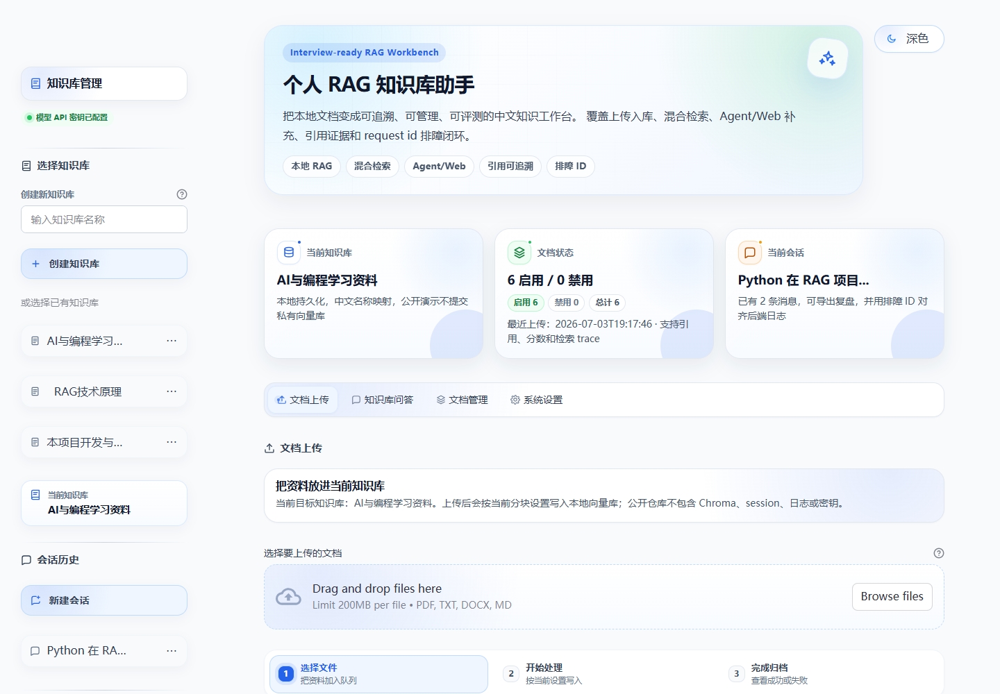
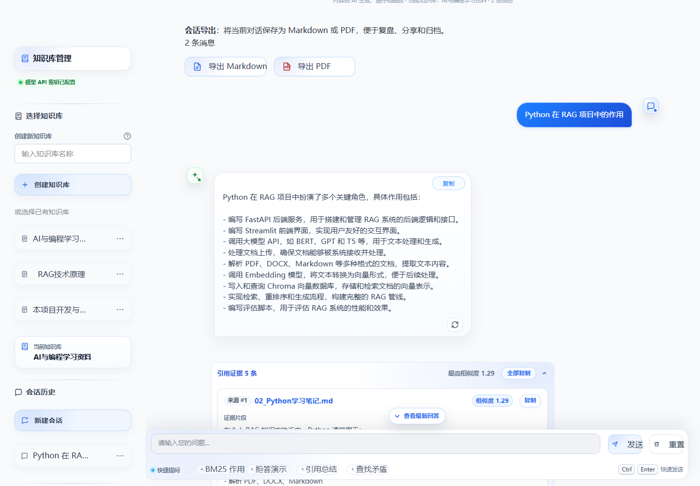
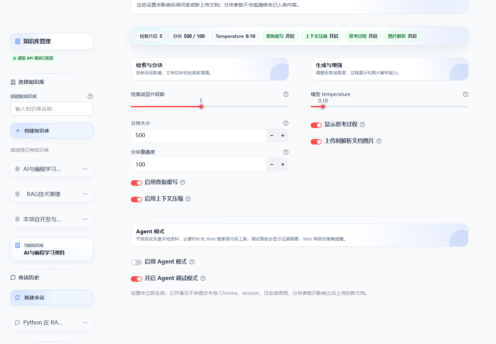
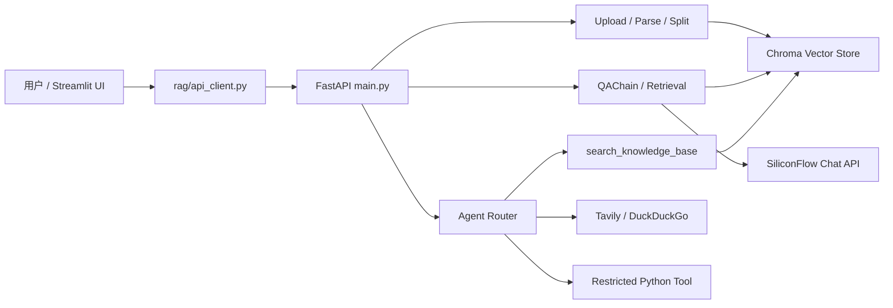

# AgentEvalKit / Personal RAG Knowledge Base Assistant

[中文](#中文说明) | [English](#english)

AgentEvalKit is an interview-ready personal RAG knowledge base assistant built with **FastAPI + Streamlit + LangChain + Chroma + SiliconFlow + Tavily**. It is designed to demonstrate a complete, maintainable AI application: document ingestion, hybrid retrieval, grounded answers with citations, Agent tool routing, Web fallback, request-id diagnostics, and evaluation baselines.

AgentEvalKit 是一个面向面试展示和长期维护的个人 RAG 知识库助手，技术栈为 **FastAPI + Streamlit + LangChain + Chroma + SiliconFlow + Tavily**。项目重点不是简单 demo，而是把文档入库、混合检索、引用追踪、Agent 工具调用、Web 降级、request id 排障和评测基线做成完整闭环。



## 中文说明

### 项目亮点

- **完整 RAG 闭环**：支持 PDF、TXT、DOCX、Markdown 上传，经过解析、标题感知分块、embedding、Chroma 持久化、检索、生成和引用展示。
- **可解释检索质量**：向量检索 + BM25 + 关键词候选 + rerank + contextual compression，并输出 source、score、candidate_source 和 trace。
- **中文知识库体验**：支持中文知识库名称、多知识库切换、文档启用/禁用、批量管理、多会话和导出。
- **Agent + Web 搜索融合**：Agent 可调用本地知识库、Tavily/DuckDuckGo Web 搜索和受限 Python 工具；本地问题有 local-first 兜底、路由约束、失败降级和 evidence summary。
- **工程化护栏**：API token、上传校验、request id 全链路日志、前端排障 ID、RAG eval、Agent eval、后端/前端契约测试和 GitHub Actions CI。

### 界面预览

| 工作台 | 问答与引用 | Agent 调试 |
| --- | --- | --- |
|  |  |  |

截图只展示脱敏演示内容，不包含 `.env`、密钥、本地 Chroma、日志或私有文档正文。

### 快速开始

推荐 Python 3.11。

```powershell
conda create -n ai_project python=3.11
conda activate ai_project
pip install -r requirements.txt
```

复制环境变量模板：

```powershell
Copy-Item .env.example .env
```

至少配置：

```env
LLM_API_KEY=sk-your-api-key-here
LLM_API_BASE=https://api.siliconflow.cn/v1
LLM_MODEL=Qwen/Qwen2.5-7B-Instruct
EMBEDDING_MODEL=BAAI/bge-large-zh-v1.5
```

启动服务：

```powershell
.\start_backend_stable.ps1
.\start_frontend.ps1
```

访问地址：

- 前端：`http://127.0.0.1:8501`
- 后端：`http://127.0.0.1:8000`
- API 文档：`http://127.0.0.1:8000/docs`
- 健康检查：`http://127.0.0.1:8000/health`

### 公开演示路线

公开仓库不提交真实 `chroma_db/`、日志、session、缓存、真实 eval report 或私有知识库内容。首次运行请重新上传脱敏资料。

推荐上传：

- `zhishiku/demo_rag_workbench.md`
- `zhishiku/demo_agent_debug.md`

建议演示问题：

```text
BM25 在 RAG 检索中有什么作用？
这些资料是否说明了火星基地厨房的虚构配置项？
Agent 为什么应该优先检索本地知识库？
```

演示重点：

- 正常知识库问答和引用来源。
- 未知问题短拒答，不胡编。
- Agent debug 中的 `routing_decision`、`tool_sequence`、`evidence_summary`、`search_trace` 和 fallback 信息。
- 前端失败提示中的排障 ID，可对应后端 `logs/app.log` 中的 request id。

更多演示脚本见：

- `docs/DEMO_PACKAGE.md`
- `docs/INTERVIEW_GUIDE.md`
- `docs/AGENT_GUIDE.md`

### 架构概览



### 项目结构

```text
personal-rag-assistant/
├── main.py                         # FastAPI backend
├── streamlit_app.py                # Streamlit entry
├── config.py                       # Environment and runtime config
├── rag/                            # RAG, Agent, vector store, tools
├── ui/                             # Streamlit UI modules and CSS
├── eval/                           # RAG eval and Agent eval
├── tests/                          # Unit and contract tests
├── scripts/check_backend_release.py
├── docs/                           # Guides, screenshots, known issues
├── zhishiku/demo_*.md              # Public sanitized demo docs
├── .github/workflows/ci.yml
├── .env.example
└── README.md
```

### 常用 API

健康检查：

```bash
curl http://127.0.0.1:8000/health
```

上传文档：

```bash
curl -X POST "http://127.0.0.1:8000/upload" \
  -F "file=@example.pdf" \
  -F "collection_name=默认知识库" \
  -F "chunk_size=500" \
  -F "chunk_overlap=100" \
  -F "enable_multimodal=true"
```

问答：

```bash
curl -X POST "http://127.0.0.1:8000/ask" \
  -H "Content-Type: application/json" \
  -d '{
    "question": "这份资料的核心观点是什么？",
    "collection_name": "默认知识库",
    "chat_history": [],
    "top_k": 3,
    "temperature": 0.1,
    "enable_query_rewrite": true,
    "enable_contextual_compression": true
  }'
```

Agent：

```bash
curl -X POST "http://127.0.0.1:8000/agent" \
  -H "Content-Type: application/json" \
  -d '{
    "question": "Agent 为什么应该优先检索本地知识库？",
    "collection_name": "默认知识库",
    "chat_history": [],
    "debug": true
  }'
```

所有 HTTP 响应都会带上：

- `X-Request-ID`
- `X-Process-Time-Ms`

### 评测与质量基线

RAG eval：

```powershell
python eval\rag_eval.py --api-base http://127.0.0.1:8000
python eval\rag_eval.py --api-base http://127.0.0.1:8000 --output-json eval\rag_eval_report.json
```

Agent eval：

```powershell
python eval\agent_eval.py --api-base http://127.0.0.1:8000 --collection-name default
python eval\agent_eval.py --api-base http://127.0.0.1:8000 --output-json eval\agent_eval_report.json
```

当前本地基线：

- RAG eval：`14/14`
- Agent eval：`5/5`

`eval/rag_eval_report.json` 和 `eval/agent_eval_report.json` 是本地评测产物，不应提交到公开仓库。

### 发布前检查

后端发布检查：

```powershell
python scripts\check_backend_release.py --api-base http://127.0.0.1:8000
```

如果后端没有启动，只跳过 health probe：

```powershell
python scripts\check_backend_release.py --no-health
```

该脚本会检查：

- Git 是否跟踪 `.env`、`chroma_db/`、日志、缓存、eval report 等本地产物。
- 已跟踪文本文件中是否存在真实密钥或 Bearer token。
- `collection_name_mapping.json` 与 Chroma collection 是否一致。
- `/health` 是否返回 request id。

### GitHub Actions CI

仓库包含 `.github/workflows/ci.yml`。CI 会：

- 安装 `requirements.txt`。
- 编译关键模块。
- 校验 RAG/Agent eval JSON。
- 运行 mock/static 轻量测试。
- 执行 `scripts/check_backend_release.py --no-health`。

CI 不依赖真实 LLM key、Tavily key、Chroma 数据或正在运行的后端。

### 测试命令

```powershell
python -m pytest tests\test_maintenance_smoke.py tests\test_api_client.py tests\test_eval.py tests\test_agent_eval.py tests\test_tools_tavily.py tests\test_frontend_ui_contracts.py -q
```

更完整的本地回归：

```powershell
python -m pytest tests\test_main_endpoints.py tests\test_vector_store.py tests\test_qa_chain.py -q
python -m pytest tests\test_agent_debug.py tests\test_tools_tavily.py tests\test_eval.py -q
```

### 安全与发布策略

公开仓库只保留：

- 源码
- 测试
- 文档
- 截图
- 脱敏 demo 文档

不会提交：

- `.env`
- `chroma_db/`
- `logs/`
- `data/`
- `.cache/`
- `eval/*_eval_report.json`
- Chroma 备份或导出
- 私有知识库正文

## English

### Highlights

- **End-to-end RAG pipeline**: upload, parse, split, embed, persist to Chroma, retrieve, generate, and cite sources.
- **Explainable retrieval**: vector search + BM25 + keyword candidates + rerank + contextual compression, with source scores and trace diagnostics.
- **Chinese-friendly knowledge bases**: Chinese collection names, multi-collection switching, document enable/disable, batch management, and sessions.
- **Agent layer**: local knowledge search, Tavily/DuckDuckGo Web search, restricted Python tool, local-first fallback, routing constraints, failure fallback, and evidence summary.
- **Engineering guardrails**: API token, upload validation, request-id logging, frontend diagnostic IDs, RAG eval, Agent eval, contract tests, and GitHub Actions CI.

### Quick Start

```powershell
conda create -n ai_project python=3.11
conda activate ai_project
pip install -r requirements.txt
Copy-Item .env.example .env
```

Edit `.env`:

```env
LLM_API_KEY=sk-your-api-key-here
LLM_API_BASE=https://api.siliconflow.cn/v1
LLM_MODEL=Qwen/Qwen2.5-7B-Instruct
EMBEDDING_MODEL=BAAI/bge-large-zh-v1.5
```

Start the app:

```powershell
.\start_backend_stable.ps1
.\start_frontend.ps1
```

Open:

- Frontend: `http://127.0.0.1:8501`
- Backend: `http://127.0.0.1:8000`
- API docs: `http://127.0.0.1:8000/docs`

### Demo Flow

Create a new knowledge base and upload:

- `zhishiku/demo_rag_workbench.md`
- `zhishiku/demo_agent_debug.md`

Ask:

```text
BM25 在 RAG 检索中有什么作用？
这些资料是否说明了火星基地厨房的虚构配置项？
Agent 为什么应该优先检索本地知识库？
```

Show:

- Answer with citations and scores.
- Unknown-question refusal.
- Agent debug panel with routing decision, tool sequence, evidence summary, search trace, and fallback details.

### Evaluation

RAG:

```powershell
python eval\rag_eval.py --api-base http://127.0.0.1:8000
```

Agent:

```powershell
python eval\agent_eval.py --api-base http://127.0.0.1:8000 --collection-name default
```

Current local baseline:

- RAG eval: `14/14`
- Agent eval: `5/5`

### Release Check

```powershell
python scripts\check_backend_release.py --api-base http://127.0.0.1:8000
```

Without a running backend:

```powershell
python scripts\check_backend_release.py --no-health
```

### Documentation

- `docs/INTERVIEW_GUIDE.md`: interview script.
- `docs/AGENT_GUIDE.md`: Agent capabilities, boundaries, debug fields, and eval.
- `docs/DEMO_PACKAGE.md`: sanitized demo package.
- `docs/KNOWN_ISSUES.md`: recurring pitfalls.
- `PROJECT_MAP.md`: repository map for maintainers.

### License

MIT.
