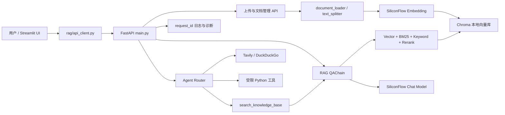
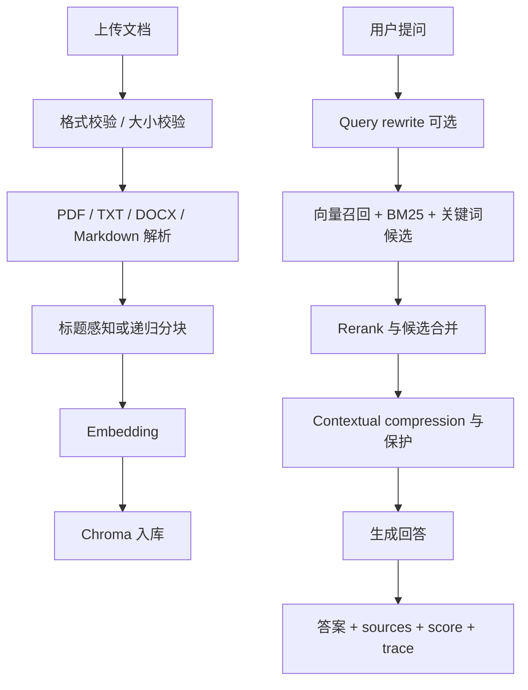

# 面试讲解指南

本文档用于面试前快速复盘项目。建议展示顺序：README -> 本地 UI -> 架构图 -> RAG eval -> 关键代码 -> 测试与日志。发布到 GitHub 前，先按 `docs/OPEN_SOURCE_CHECKLIST.md` 做一次公开仓库安全检查。

## 3 分钟版本

这是一个本地个人 RAG 知识库助手，目标是把个人文档变成可追溯、可管理、可评测的问答系统。前端用 Streamlit，后端用 FastAPI，RAG 层基于 LangChain、Chroma 和 SiliconFlow 兼容接口，额外接入 Tavily 做 Web 搜索补充。

核心链路是：用户上传 PDF/TXT/DOCX/Markdown，后端解析、分块、生成 embedding 并写入 Chroma；提问时先做本地知识库检索，结合向量、BM25、关键词兜底、rerank 和上下文压缩，再把片段交给模型生成回答。回答会展示引用来源、分数和检索 trace，方便定位为什么命中某个片段。

工程化上，我做了 API token、上传校验、request id 全链路日志、前端失败排障 ID、Agent debug evidence summary，以及 RAG eval 基线。当前真实 eval 已经跑到 14/14，通过项覆盖检索、生成、拒答和 trace 诊断。

## 8 分钟版本

1. **产品目标**：个人资料不是一次性问答，而是长期积累、可维护和可排障的知识库，所以系统支持多知识库、多会话、文档管理、引用追踪和本地持久化。
2. **上传入库**：文档进入 FastAPI 后先做扩展名、MIME、文件头和内容校验，再按格式解析。Markdown 会按标题结构分块，普通文本走递归分块；embedding 统一写入 Chroma。
3. **检索质量**：检索不是只靠向量。系统把向量召回、BM25、关键词候选和重排组合起来，并对上下文压缩做保护，防止高置信片段被压缩丢失。
4. **生成与拒答**：生成层会基于检索片段回答，并带引用来源。对于明显超出资料范围的问题，有实体覆盖守卫，避免模型把相近但不相关的资料整理成“相关要点”。
5. **Agent 融合**：Agent 可调用本地知识库、Web 搜索和受限代码工具。本地资料问题即使误先搜 Web，也会自动补本地证据；debug 中统一显示 evidence summary、tool sequence、search trace 和 policy violations。
6. **可观测性**：每个 HTTP 响应带 `X-Request-ID`，后端日志、子模块日志、前端失败提示和 eval report 都能围绕同一个 request id 排查。
7. **测试与评测**：单测覆盖上传校验、分块、向量库、API、Agent、Tavily trace、前端契约；真实 RAG eval 用固定 case 验证 source、score、trace、答案关键词和答案长度。
8. **发布安全**：公开仓库不提交 `.env`、Chroma 数据、session、日志、缓存、备份向量库和本地 eval report，只保留源码、测试、文档和脱敏示例资料。

## 架构图

## RAG 流程图

## 可展开技术点

- **为什么混合检索**：向量召回更适合语义相近，BM25 更适合精确关键词，关键词兜底用于避免专有名词漏召回。
- **为什么要 trace/eval**：RAG 质量问题常常不是模型回答问题，而是检索、重排、压缩或样例本身的问题；结构化 failure reasons 可以把问题拆开。
- **为什么 request id 很重要**：前端看到失败时可以直接拿排障 ID 查后端日志，定位到 endpoint、RAG 子模块或工具调用。
- **为什么不提交 Chroma 数据**：公开仓库要避免私有文档泄露和大文件污染；演示时用脱敏文档重新上传生成本地向量库。

## 面试演示清单

- 打开 README，说明项目定位和亮点。
- 启动后端和前端，展示知识库列表、上传入口和问答页。
- 提问 `BM25 在 RAG 检索中有什么作用？`，展示回答、引用和 score。
- 提问 `这些资料是否说明了火星基地厨房的虚构配置项？`，展示标准短拒答。
- 展示 `eval/rag_eval.py` 和 `eval/eval_cases.json`，说明 14/14 eval 基线。
- 展示 `tests/test_agent_debug.py`、`tests/test_frontend_ui_contracts.py` 或 `tests/test_main_endpoints.py`，说明工程护栏。
- 展示 `docs/OPEN_SOURCE_CHECKLIST.md`，说明公开仓库不会提交 `.env`、Chroma、日志、缓存、真实 eval report 或私有文档。

## 前端演示路线

1. **工作台首屏**：从 Hero 说明这是本地个人 RAG 工作台，顺手点出多知识库、上传入库、引用追踪、Agent/Web 和排障 ID。
2. **空状态/上传页**：强调公开仓库不带 Chroma、session、日志或密钥，首次运行用少量脱敏 Markdown/PDF 重新上传。
3. **正常问答**：使用快捷问题 `BM25 在 RAG 检索中有什么作用？`，打开引用证据面板，展示来源编号、文件名、相似度、证据片段和复制按钮。
4. **拒答边界**：使用 `这些资料是否说明了火星基地厨房的虚构配置项？`，展示系统不会把相近但无关的资料整理成答案。
5. **Agent debug**：在系统设置说明 Agent 本地优先、必要时 Web 补充；打开调试结果时优先讲 evidence summary、Web provider/fallback 和 policy violations。
6. **排障链路**：如果演示中出现失败提示，复制排障 ID，在 `logs/app.log` 中按 `request_id=<ID>` 搜索定位。

## 截图清单

- `docs/images/workbench.png`：工作台首屏，展示 Hero、知识库/文档/会话概览。
- `docs/images/rag-answer-sources.png`：正常问答与引用证据面板，避免包含私有文档全文。
- `docs/images/agent-debug.png`：系统设置或 Agent debug 面板，展示本地优先、证据摘要和 Web fallback 说明。

截图前确认页面没有显示 `.env`、密钥、私有路径、真实用户资料或未脱敏文档内容。
